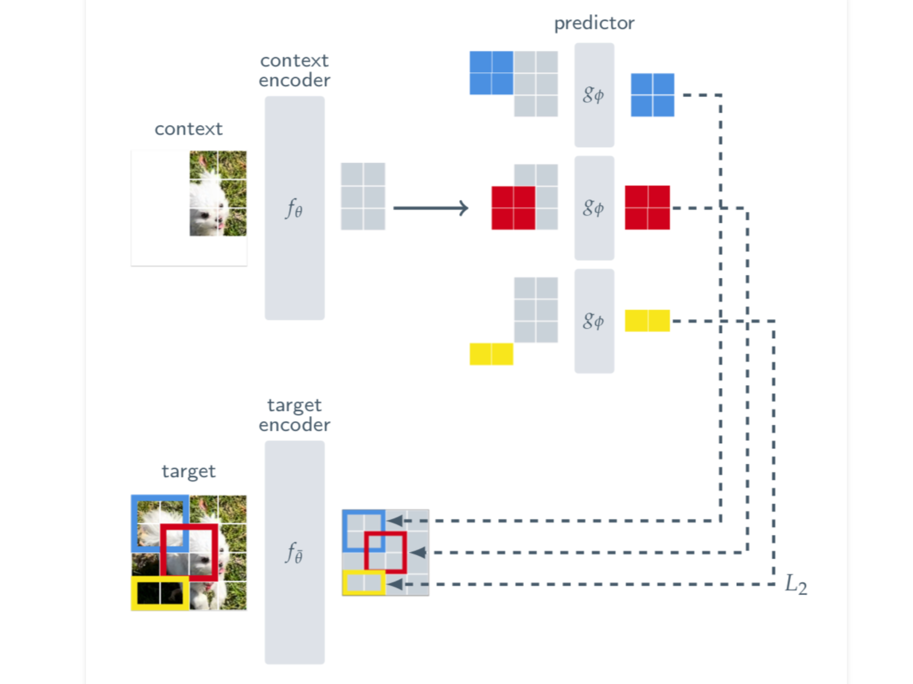

# 🧠 I-JEPA: Image Joint-Embedding Predictive Architecture

> A PyTorch implementation of **I-JEPA** (Image Joint-Embedding Predictive Architecture), inspired by the work of Yann LeCun and Meta AI.

---

## 📘 Introduction

**I-JEPA** is a self-supervised learning framework introduced in the paper:

> **"Self-supervised learning from images with a joint-embedding predictive architecture"**  
> Yann LeCun, Mathilde Caron, Piotr Bojanowski, Armand Joulin, Ishan Misra, et al.  
> [📄 arXiv:2301.08243](https://arxiv.org/abs/2301.08243)

Unlike pixel-level reconstruction methods (e.g., MAE), **I-JEPA** encourages models to reason at a **semantic level** by predicting **high-level representations** of masked image regions. This results in more robust and scalable visual representations for downstream tasks.

---

## 🚀 Key Highlights

- ✅ Predicts latent **feature embeddings**, not raw pixels  
- ✅ Uses **block-based masking** and **Vision Transformers (ViT)**  
- ✅ Dual-network architecture: **encoder** & **predictor**  
- ✅ Flexible **mask collator** with custom scale/aspect-ratio  
- ✅ Simple and extensible codebase for research or experimentation

---

## 🖼️ Architecture Overview




## 📚 Reference

**Citation:**

```bibtex
@article{lecun2023ijepa,
  title={Self-supervised learning from images with a joint-embedding predictive architecture},
  author={LeCun, Yann and Caron, Mathilde and Bojanowski, Piotr and Joulin, Armand and Misra, Ishan and Synnaeve, Gabriel and Zhai, Xiaohua},
  journal={arXiv preprint arXiv:2301.08243},
  year={2023}
}
```

- 🔗 [Paper on arXiv](https://arxiv.org/abs/2301.08243)

---

## 🙏 Acknowledgements

- Core concept and methodology by [Meta AI Research](https://ai.facebook.com/research/).
- Masking and collator logic inspired by the official I-JEPA and DINO repositories.

---

## 📬 Contact

- GitHub: [@aymen-000](https://github.com/aymen-000)  
- Email: [aymne011@gmail.com](mailto:aymne011@gmail.com)

---

⭐️ Star this repo if you find it useful!
